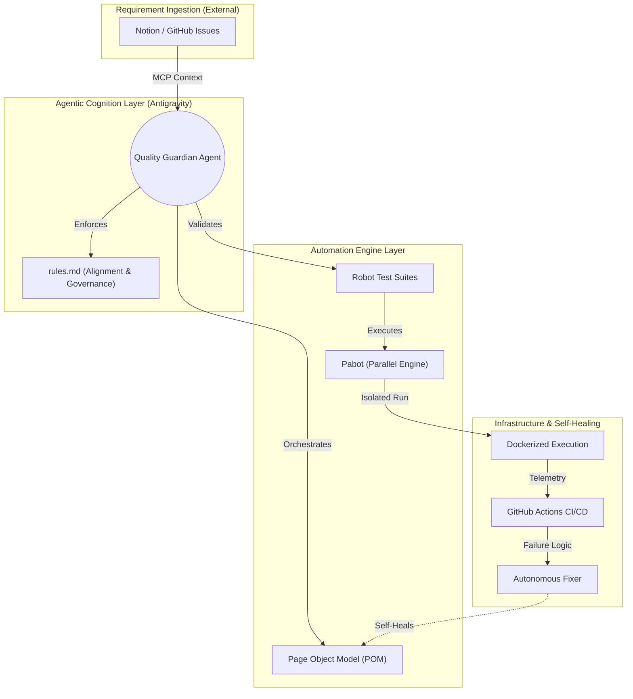
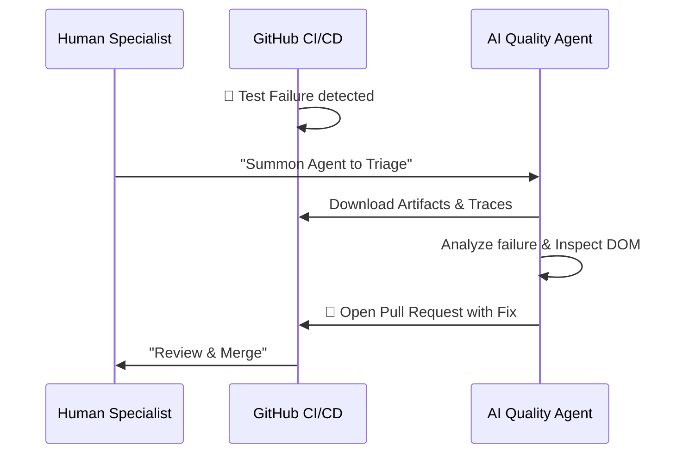

# ⚛️ Autonomous Quality Engineering Framework


[](https://mehtomate.github.io/test-automation-playground/)
[](#-parallel-execution-pabot)

This repository demonstrates an experimental **AI-Native Test Automation Framework**. Designed to be consumed by autonomous agents via the **Model Context Protocol (MCP)**, it bridges the gap between high-level business requirements and verifiable, self-healing automation.

---

## 🏗 Framework Architecture: The Autonomous Loop

This framework implements a consultative, "Requirement-to-Code" architecture where AI Agents act as the primary orchestrators of the quality lifecycle.



### 🛠 Tech Stack & Ecosystem 
| Component | Technology | Role |
| :--- | :--- | :--- |
| **Core Engine** | Robot Framework | Declarative E2E Testing |
| **Web Driver** | Playwright (Browser Library) | High-Performance Browser Automation |
| **Agentic Auth** | Model Context Protocol (MCP) | Standardized Agent Connectivity |
| **Cognitive Quality** | **TextBlob (NLP)** | **Sentiment & Intent Validation** |
| **Infrastructure**| Docker & GitHub Actions | Containerized CI/CD Portability |
| **Observability** | Allure & HD Video | Holistic Traceability & Reporting |

---

## 🚀 Accelerating Enterprise Quality with Agentic Workflows

Traditional automation is bottlenecked by manual maintenance. This framework is "AI-First," enabling:

1.  **Autonomous Requirement Mapping**: Directly converting Notion specifications into Robot Framework scripts using the [**`ticket_to_test_agent`**](.agent/prompts/ticket_to_test_agent.prompt.md).
2.  **Autonomous Alignment**: The agent adheres to strict [**.agent/rules.md**](.agent/rules.md) to ensure maintainable, high-level code that meets  standards.
3.  **Agent-Assisted Triage**: When UI shifts occur, the [**`pipeline_fixer_agent`**](.agent/prompts/pipeline_fixer_agent.prompt.md) investigates the failure logs and pushes self-healing fixes via Pull Requests.

---

## 🦾 Phase 3: Cognitive Quality (Testing AI itself)

Beyond traditional automation, this framework addresses the challenge of **Non-Deterministic Systems** (GenAI).

-   **Semantic Assertions**: Using the [**`SemanticJudge`**](resources/Libraries/SemanticJudge.py) library to verify intent, sentiment, and compliance via **Natural Language Processing (NLP)**.
-   **Intelligent Validation**: Demonstration suites like [**`ai_feature_tests.robot`**](tests/ai_feature_tests.robot) show how to test AI-native features that generate dynamic content.
-   **Strategic Strategy**: Read our [**AI Quality Strategy**](docs/AI_QUALITY_STRATEGY.md) whitepaper on handling hallucinations and bias.
-   **Education**: See the [**How It Works**](docs/HOW_IT_WORKS.md) guide for a deep dive into the cognitive validation logic.

---

## 🦾 Agent-Assisted Triage & Self-Healing

This framework follows the **Agent-Assisted Triage** model:

1.  **CI Failure Detection**: A regression is detected in GitHub Actions.
2.  **Autonomous Investigation**: A specialized AI Agent is summoned to investigate the failure logs and visit the application via a browser subagent.
3.  **Self-Healing Proposal**: The agent identifies the root cause (e.g., a changed locator) and autonomously creates a **Pull Request** with the necessary fix.
4.  **Human Verification**: The SDET (Human) reviews the PR, verifies the impact, and merges the fix.

### The Self-Healing Workflow


---

## ⚡ Parallel Execution & Performance

Suite utilizes **Pabot** to parallelize execution, reducing total run time.

**Command executed in CI:**
```bash
pabot --processes 2 -d results --listener allure_robotframework:results/allure-results tests/
```

---

## 🏁 Getting Started

### Prerequisites

#### Core (Standard Execution)
- Python 3.8+ & Node.js
- [Docker](https://www.docker.com/) (Recommended for isolated runs)

#### Agentic (Autonomous Workflows)
- [Antigravity IDE](https://antigravity.ai): The primary environment for Quality Agents.
- **MCP Connections**: Working `notion` and `github` MCP server configurations to enable requirement-to-code synchronization.

### Installation & Execution
1. **Local Install**: `pip install -r requirements.txt && rfbrowser init`
2. **Execution**: `robot -d results tests/`
3. **Parallel Run**: `pabot -d results tests/`
4. **Docker Execution**: 
   ```bash
   docker build -t saucedemo-tests .
   docker run --ipc=host -v $(pwd)/results:/app/results saucedemo-tests
   ```
5. **AI Cognitive Tests**: `python3 -m robot -d results tests/ai_feature_tests.robot`

---

## 📊 Reporting & Traceability
Comprehensive **Allure Reports** are hosted on GitHub Pages, providing full traceability from requirement to evidence (HD Video and Screenshots).
