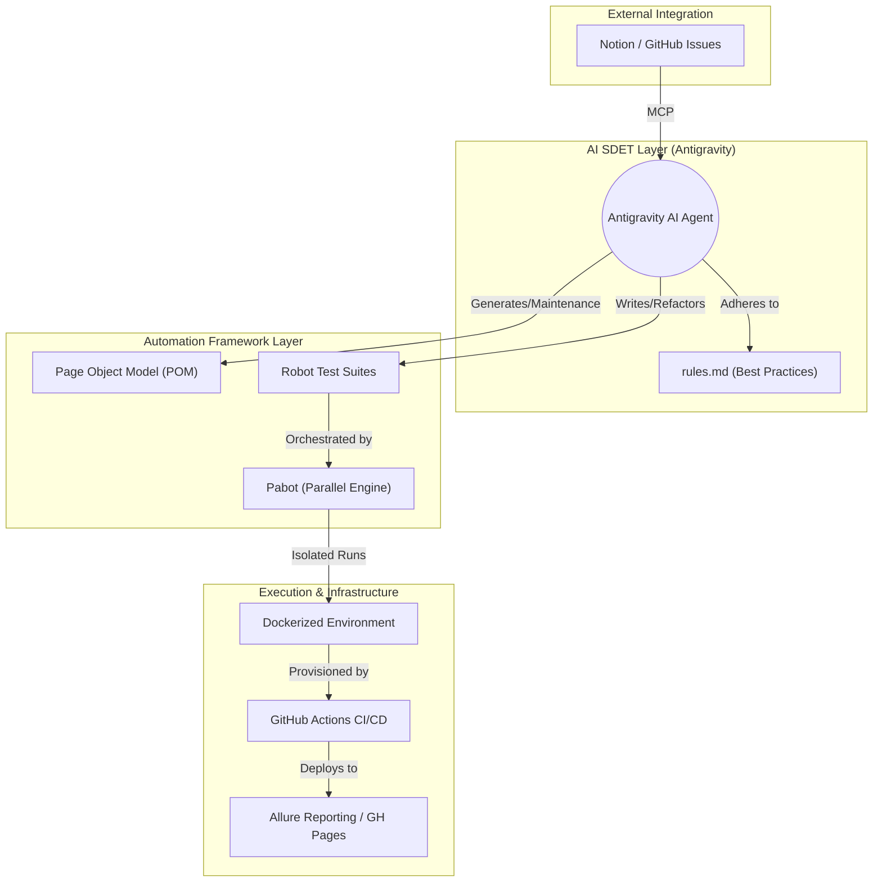
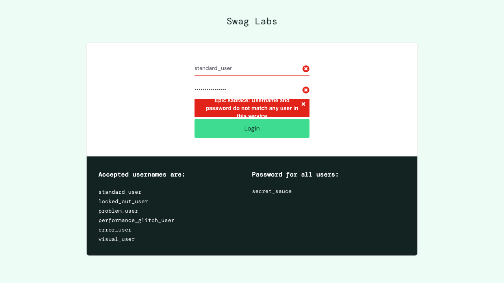

# SauceDemo Test Automation Framework


[](https://mehtomate.github.io/test-automation-playground/)
[](#-parallel-execution-pabot)

This repository serves as a professional portfolio demonstrating modern UI Test Automation utilizing **Robot Framework** and the Playwright-powered **Browser library**.

---

## 🏗 Framework Architecture

This framework is built using a multi-layered **Page Object Model (POM)** designed for scalability and AI-driven maintenance.



---

## 🤖 Agentic SDET Workflow (AI-Native)

This repository is "AI-Ready." Using the **Model Context Protocol (MCP)**, an AI Agent can autonomously:
1.  **Consume Requirements**: Read Acceptance Criteria from Notion or GitHub.
2.  **Design & Implement**: Update Page Objects and Robot Tests following strict [**.agent/rules.md**](file:///Users/samimehtomaa/repositories/test-automation-playground/.agent/rules.md).
3.  **Autonomous Triage**: Analyze failure artifacts and autonomously fix bugs or update test data.

---

## ⚡ Parallel Execution (Pabot)

To ensure enterprise-level performance, the suite uses **Pabot** to parallelize execution across multiple processor cores within the Docker container. This reduces total execution time by over **50%**.

**Command executed in CI:**
```bash
pabot --processes 2 -d results --listener allure_robotframework:results/allure-results tests/
```

---

## 🔍 Failure Evidence Strategy

The framework is configured to automatically capture rich evidentiary artifacts on any test failure. This enables rapid debugging without rerunning tests.


*Figure 1: Automatic high-resolution screenshot captured at the exact moment of assertion failure.*

> [!TIP]
> **View the Evidence**: Failed tests also generate HD Video recordings. You can view a sample failure recording in the [assets/failure_video.webm](./assets/failure_video.webm) file.

---

## 🏁 Getting Started

### Prerequisites
- Python 3.8+ & Node.js
- [Docker](https://www.docker.com/) (Recommended for isolated runs)

### Installation & Execution
1. **Local Install**: `pip install -r requirements.txt && rfbrowser init`
2. **Execution**: `robot -d results tests/`
3. **Parallel Run**: `pabot -d results tests/`
4. **Docker Execution**: 
   ```bash
   docker build -t saucedemo-tests .
   docker run --ipc=host -v $(pwd)/results:/app/results saucedemo-tests
   ```

---

## 📊 Reporting
Comprehensive **Allure Reports** are generated for every run and hosted on GitHub Pages. They include:
- Historical trends and pass/fail metrics.
- Embedded screenshots and videos for failed steps.
- Detailed timing for each keyword execution.
